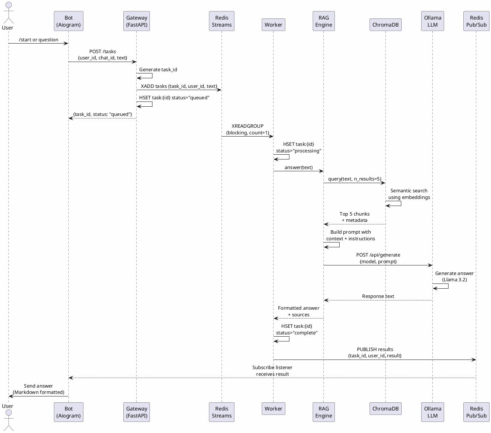
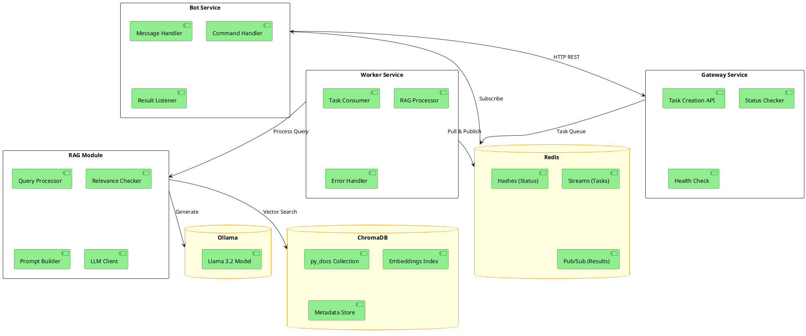
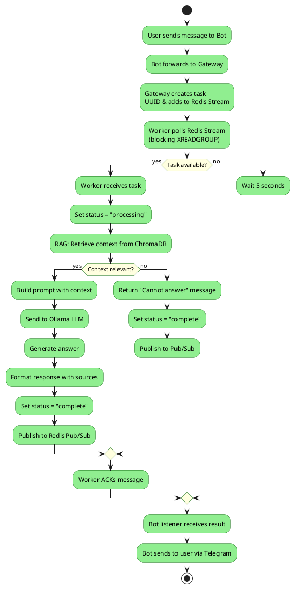
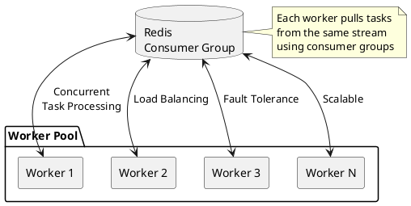

# Python Documentation RAG Telegram Bot

A scalable, asynchronous Retrieval-Augmented Generation system that answers Python programming questions via Telegram, powered by local LLM and vector search.

## 🏗️ Architecture Overview


## 📊 System Flow Diagram



## 🗂️ Component Architecture



## 📁 Project Structure

```
async-rag-system/
├── bot.py                      # Telegram bot (Aiogram)
├── gateway.py                  # FastAPI task gateway
├── worker.py                   # Async task worker
├── rag/
│   ├── __init__.py
│   ├── rag.py                  # RAG engine core
│   ├── vector_db.py            # ChromaDB operations
│   └── python_document_parser.py  # Doc scraper
├── data/
│   ├── docs/
│   │   └── python_docs.json    # Scraped documentation
│   └── chroma_db/              # Vector database
├── Dockerfile                  # Container definition
├── compose.yaml                # Docker Compose setup
├── requirements.txt            # Python dependencies
└── README.md                   # This file
```

## 🔄 Data Flow



## 🚀 Getting Started

### Prerequisites

- Docker & Docker Compose
- Ollama running locally (port 11434)
- Telegram Bot Token (from [@BotFather](https://t.me/botfather))

### Installation

1. **Clone the repository**
   ```bash
   git clone <repository-url>
   cd async-rag-system
   ```

2. **Install Ollama and pull the model**
   ```bash
   curl -fsSL https://ollama.ai/install.sh | sh
   ollama pull llama3.2
   ollama serve
   ```

3. **Set up environment variables**
   ```bash
   export BOT_TOKEN="your_telegram_bot_token"
   export REDIS_URL="redis://redis:6379"
   export GATEWAY_URL="http://gateway:8000"
   export CHROMA_PATH="data/chroma_db"
   ```

4. **Scrape and index Python documentation** (one-time setup)
   ```bash
   python -m rag.python_document_parser
   python -m rag.vector_db
   ```

5. **Start services with Docker Compose**
   ```bash
   docker-compose up --build
   ```

### Running Without Docker

```bash
# Terminal 1: Redis
redis-server

# Terminal 2: Gateway
uvicorn gateway:app --host 0.0.0.0 --port 8000

# Terminal 3: Worker(s)
python worker.py worker-1

# Terminal 4: Bot
python bot.py
```

## 🏛️ System Components

### 1. Bot Service (`bot.py`)

**Technology**: Aiogram (async Telegram bot framework)

**Responsibilities**:
- Handle incoming Telegram messages
- Send tasks to Gateway via HTTP
- Listen to Redis Pub/Sub for results
- Send formatted answers back to users

**Key Features**:
- Non-blocking message handling
- Automatic Markdown parsing with fallback
- Resilient Redis connection with auto-reconnect

### 2. Gateway Service (`gateway.py`)

**Technology**: FastAPI

**Responsibilities**:
- RESTful API for task creation
- Task status tracking
- Health check endpoint

**Endpoints**:
- `POST /tasks` - Create new task
- `GET /tasks/{id}` - Get task status
- `GET /health` - Service health check

### 3. Worker Service (`worker.py`)

**Technology**: Asyncio with Redis Streams

**Responsibilities**:
- Consumer group-based task processing
- RAG query execution
- Result publishing to Pub/Sub

**Scaling**: Multiple workers can run simultaneously using consumer groups

### 4. RAG Engine (`rag/rag.py`)

**Components**:
- **Retriever**: Semantic search using ChromaDB
- **Relevance Checker**: Distance threshold validation
- **Prompt Builder**: Context-aware prompt construction
- **Generator**: Ollama LLM integration

**Workflow**:
1. Query → Retrieve top 5 relevant chunks
2. Check relevance (distance < 0.5)
3. Build system prompt with context
4. Generate answer via Ollama
5. Format with source citations

### 5. Vector Database (`rag/vector_db.py`)

**Technology**: ChromaDB with SentenceTransformer embeddings

**Features**:
- Document chunking (500 words, 50 word overlap)
- Semantic search using `all-MiniLM-L6-v2`
- Metadata tracking (title, URL, chunk index)

### 6. Document Parser (`rag/python_document_parser.py`)

**Technology**: BeautifulSoup4 + Requests

**Coverage**: 300+ pages from official Python 3 docs including:
- Tutorial
- Standard Library
- Language Reference
- HOWTOs and FAQs

## 🔧 Configuration

### Environment Variables

| Variable | Default | Description |
|----------|---------|-------------|
| `BOT_TOKEN` | *(required)* | Telegram bot token |
| `REDIS_URL` | `redis://redis:6379` | Redis connection URL |
| `GATEWAY_URL` | `http://gateway:8000` | Gateway service URL |
| `CHROMA_PATH` | `data/chroma_db` | Vector DB storage path |

### RAG Parameters

```python
# In rag.py
n_top_results = 5           # Number of chunks to retrieve
relevance_threshold = 0.5   # Distance threshold for relevance
temperature = 0.1           # LLM temperature (lower = more focused)
max_tokens = 500           # Maximum response length
```

## 📈 Scaling Considerations

### Horizontal Scaling



**To add more workers**:
```bash
docker-compose up --scale worker=5
```

### Performance Optimization

- **Batch Processing**: Workers process tasks concurrently
- **Connection Pooling**: Redis connections are reused
- **Caching**: ChromaDB embeddings cached on disk
- **Rate Limiting**: Configurable block timeout in Redis Streams

## 🧪 Testing

```bash
# Test RAG system directly
python -m rag.rag

# Test vector retrieval
python -m rag.vector_db

# Test document parsing
python -m rag.python_document_parser
```

## 📝 Example Interactions

**User**: "How do I open and read a file in Python?"

**Bot Response**:
```
To open and read a file in Python, use the built-in open() function 
with the 'r' mode. [SOURCE 1]

Example:
with open('file.txt', 'r') as f:
    content = f.read()

The 'with' statement ensures the file is properly closed. [SOURCE 2]

Sources:
- https://docs.python.org/3/tutorial/inputoutput.html
- https://docs.python.org/3/library/functions.html
```

## 🛡️ Error Handling

- **Ollama Connection**: Returns error message if Ollama is down
- **Irrelevant Queries**: Detects and rejects non-Python questions
- **Redis Failures**: Auto-reconnection with exponential backoff
- **Telegram Errors**: Markdown parsing fallback to plain text

## 🚧 Limitations

- Only answers questions from indexed Python documentation
- Requires Ollama running on `host.docker.internal:11434`
- English language only
- Maximum context window depends on LLM model

## 🔮 Future Enhancements

- [ ] Add conversation history
- [ ] Support multiple programming languages
- [ ] Implement user feedback loop
- [ ] Add answer caching
- [ ] Web interface dashboard
- [ ] Metrics and monitoring (Prometheus)

## 📄 License

MIT License

## 🤝 Contributing

Contributions welcome! Please read CONTRIBUTING.md first.

## 📧 Contact

For questions and support, open an issue on GitHub.

---

**Built with ❤️ using Python, ChromaDB, Ollama, and Aiogram**
